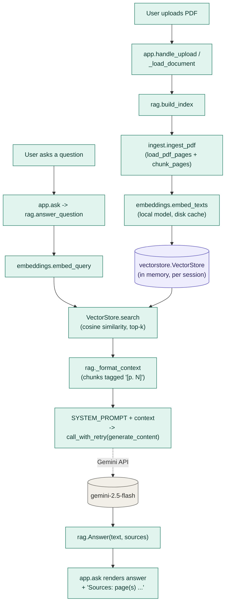
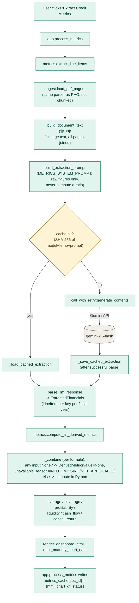

# Architecture & Code Playbook — Credit Risk Analyzer

This document explains how the app actually works, at the level of specific
functions and files, so a new contributor (or the author, before an
interview) can trace any behavior back to code. It documents the
implementation as it exists today, not the aspirational README. Where the
docs and the code agree, this playbook says so and points at the enforcing
code. Where they diverge, that's called out explicitly in
[§9 Known gaps / claim-vs-code](#9-known-gaps--claim-vs-code) instead of
being repeated as fact.

---

## 1. Mental model

**This app is two independent pipelines that happen to share a Gradio UI and
a PDF parser.** They are not variations on a theme — they don't call each
other, and one wasn't refactored out of the other. Understanding *why* they
're separate is the single most important thing to internalize about this
codebase.

- **Q&A is RAG** (`rag.py`). The question a user asks is unpredictable and
  open-ended ("what are the risk factors on litigation?"). You cannot know in
  advance which few hundred words of a 100+ page filing are relevant, so the
  standard move is: index the whole document once, then retrieve only the
  handful of chunks that are semantically close to *this* question, and
  answer from those. Grounding + citations come almost for free once you're
  already only showing the model text with a page tag on it.

- **Credit metrics is deliberately *not* RAG** (`metrics.py`). Here the
  question is fixed in advance: "give me revenue, debt, cash flow, and about
  30 other line items." Retrieval buys nothing when you already know exactly
  what you're looking for and need *all* of it simultaneously to compute
  cross-statement ratios (e.g. `total_debt` needs three balance-sheet lines,
  `ebitda_to_interest_expense` needs both an income-statement line and a
  debt-note line). Top-k similarity search could easily miss one of the ~30
  keys a ratio depends on, silently breaking a downstream calculation. So the
  whole filing, page-tagged, goes to the model in a single long-context call
  instead — see `metrics.build_document_text` and
  `metrics.build_extraction_prompt`.

The second design decision that matters as much as RAG-vs-not is **who does
the arithmetic**. In `metrics.py`, the LLM's only job is to *read off* raw,
printed numbers — never to add, divide, or compute a ratio. Every formula
(margins, leverage, coverage, liquidity, cash flow, capital return) is
ordinary Python in `metrics.py`. This is enforced by `METRICS_SYSTEM_PROMPT`
(`config.py`) instructing the model to extract only raw line items, and by
the fact that `parse_llm_response` only ever populates `LineItem` objects —
there is no code path where a model-produced ratio becomes a `DerivedMetric`.
The rationale, in the module docstring's own words: *"a wrong number is worse
than none, and LLMs are unreliable at arithmetic."*

The corollary of "Python computes everything" is **null propagation**: if a
`DerivedMetric` depends on an input that wasn't extracted, the metric
resolves to `None` with a typed reason — never a value computed by treating
the missing input as zero. This is enforced in one place, `metrics._combine`
(§4), and it's the mechanism the rest of the ratio engine is built on top of.

Keep these two ideas in mind while reading the rest of this document:
**RAG exists because the question is unpredictable; metrics extraction exists
because the question is fixed and needs everything at once; and in both
paths, the LLM is kept as far as possible from doing math or asserting facts
it wasn't given.**

---

## 2. Repository map

```
app.py                                  Gradio UI + state wiring (entrypoint)
src/credit_risk_analyzer/
  config.py       Models, chunk size/overlap, top-k, both system prompts
  ingest.py        PDF -> page text -> page-tagged chunks
  embeddings.py    Local (sentence-transformers) embeddings + disk cache
  vectorstore.py   In-memory brute-force cosine-similarity search
  rag.py           Q&A orchestration: build_index, answer_question
  metrics.py       Long-context extraction + Python ratio engine + HTML render
  retry.py         Retry/backoff wrapper for Gemini calls
  session.py       Session dataclass + replace-session semantics
tests/             pytest suite, no API key/network required
docs/
  REQUIREMENTS.md  FR/NFR spec (traceability IDs referenced in architecture.md)
  architecture.md  Prior design write-up (this playbook supersedes it for
                    implementation detail; see §9 for where they now diverge)
```

| Module | Owns | Key functions/classes |
|---|---|---|
| `config.py` | Every tunable constant, both system prompts | `SYSTEM_PROMPT`, `METRICS_SYSTEM_PROMPT`, `CHUNK_SIZE`, `TOP_K`, `CHAT_MODEL`, `METRICS_MODEL` |
| `ingest.py` | PDF parsing + chunking, shared by both paths | `Chunk`, `load_pdf_pages`, `_split`, `chunk_pages`, `ingest_pdf` |
| `embeddings.py` | Text → vector, with a disk cache keyed on content | `embed_texts`, `embed_query`, `_build_cache_key`, `_get_model` |
| `vectorstore.py` | Cosine-similarity search over one document's chunks | `VectorStore.add`, `VectorStore.search` |
| `rag.py` | Q&A pipeline: index, retrieve, prompt, cited answer | `build_index`, `answer_question`, `_format_context`, `Answer` |
| `metrics.py` | Extraction prompt/parsing + every ratio formula + dashboard HTML | `extract_line_items`, `parse_llm_response`, `_combine`, `compute_leverage`/`compute_coverage`/`compute_profitability`/`compute_liquidity`/`compute_cash_flow`/`compute_capital_return`, `compute_all_derived_metrics`, `render_dashboard_html` |
| `retry.py` | 429/5xx retry with server-suggested delay; fail-fast on daily quota | `call_with_retry`, `DailyQuotaExceededError` |
| `session.py` | Active-document + chat-history state, "replace" semantics | `Session`, `start_new_session`, `needs_confirmation` |
| `app.py` | Gradio `Blocks` UI, event wiring, `doc_id`/`metrics_cache` state | `handle_upload`, `confirm_upload`, `_load_document`, `ask`, `process_metrics`, `_metrics_view`, `_document_id` |

Both `rag.py` and `metrics.py` depend on `ingest.py` and `config.py`, but not
on each other — there is no import of `rag` in `metrics.py` or vice versa.
`app.py` is the only module that imports both.

---

## 3. Data flow: Q&A path



**Indexing (once per upload).** `app._load_document` calls
`rag.build_index(path, on_progress)`. That function:
1. `ingest.ingest_pdf` → `load_pdf_pages` (pypdf, page text via
   `enumerate(reader.pages, start=1)` — the page number is *reading order*,
   not the printed label) → `chunk_pages` (character-based sliding window,
   `_split`, using `CHUNK_SIZE`/`CHUNK_OVERLAP` from `config.py`). Each
   resulting `Chunk` carries `text`, `page`, `chunk_id`, `source`.
2. `embeddings.embed_texts` embeds every chunk's text with a local
   `sentence-transformers` model (`EMBEDDING_MODEL`, default
   `BAAI/bge-small-en-v1.5`) — **no API call for embedding**. Results are
   cached to disk under `CACHE_DIR`, keyed by a SHA-256 of the PDF's raw
   bytes + model name + chunk config (`_build_cache_key`), so re-uploading
   the same PDF with the same settings skips re-embedding entirely
   (`_load_cached_vectors`/`_save_cached_vectors`).
3. `VectorStore.add` L2-normalizes the vectors and appends them (and their
   chunks) to an in-memory `(n, d)` numpy matrix.

**Querying (once per question).** `app.ask` calls
`rag.answer_question(store, question)`:
1. `embeddings.embed_query` embeds the question with the same model.
2. `VectorStore.search` computes `matrix @ query` (cosine similarity, since
   both sides are unit-normalized) and returns the top `k` `(Chunk, score)`
   pairs (`TOP_K`, default 4).
3. `rag._format_context` joins the hits into `"[p. N] <chunk text>"` blocks.
4. The prompt (`SYSTEM_PROMPT` from `config.py` as `system_instruction`, plus
   the context + question as the user turn) is sent via
   `retry.call_with_retry(...generate_content...)` to `CHAT_MODEL`
   (`gemini-2.5-flash`).
5. `app.ask` appends the answer text plus a `*Sources: page(s) ...*` footer
   (built from `sorted({c.page for c, _ in result.sources})`) to the chat
   history.

---

## 4. Data flow: credit-metrics path



**Extraction.** `metrics.extract_line_items(pdf_path)`:
1. `ingest.load_pdf_pages` parses the PDF (same function the RAG path uses —
   this is the one piece of real code reuse between the two paths — but the
   output is *not* chunked or embedded).
2. `build_document_text` concatenates every page as `"[p. N]\n<page text>"`.
3. `build_extraction_prompt` wraps that in a prompt listing all 30
   `LINE_ITEM_KEYS` (revenue, margins, balance-sheet items, cash-flow items,
   etc.) plus a JSON schema example (`_SCHEMA_EXAMPLE`), and asks for the
   future debt-maturity schedule too.
4. The prompt is hashed (`_extraction_cache_key`: SHA-256 of
   `METRICS_MODEL|METRICS_TEMPERATURE|prompt`) and checked against
   `METRICS_CACHE_DIR` on disk. A hit returns instantly with zero API calls.
   A miss calls Gemini via `retry.call_with_retry`, **parses the response
   before caching it** (`parse_llm_response` first, then
   `_save_cached_extraction` — the comment in the code is explicit: *"never
   cache invalid JSON"*).
5. `parse_llm_response` strips markdown code fences (`_strip_code_fences`),
   parses JSON, and defensively builds an `ExtractedFinancials`: every key in
   `LINE_ITEM_KEYS` gets an entry (possibly an empty `{}` if the model
   didn't report it for any year), each populated as a
   `LineItem(value, unit, fiscal_year, source_statement, page)`.

**Computation — the extract/compute split in practice.** The model's output
at this point is *only* `LineItem`s: raw values with a fiscal year, a
statement name, and a page. No ratio exists yet. `compute_all_derived_metrics`
calls six grouping functions (`compute_leverage`, `compute_coverage`,
`compute_profitability`, `compute_liquidity`, `compute_cash_flow`,
`compute_capital_return`), each of which builds `DerivedMetric`s by calling
the one function all of them funnel through: **`_combine`**.

`_combine(name, formula, fiscal_year, inputs, fn, unit)` is the null-
propagation engine:
- It first checks every entry in `inputs` (a dict of `LineItem | DerivedMetric
  | None`). If any is `None` or has `.value is None`, it returns a
  `DerivedMetric(value=None, unavailable_reason=UnavailableReason.INPUT_MISSING,
  reason="not available: " + <which inputs, and why, e.g. "commercial_paper
  (not extracted from filing)">)` — **the formula `fn` is never even called**.
- If all inputs are present, it calls `fn(values)`. A `ZeroDivisionError` is
  caught and converted to `unavailable_reason=NOT_APPLICABLE` (the inputs
  existed; the ratio is undefined for those values — e.g. zero current
  liabilities) rather than propagated as a crash or silently producing `inf`.
- Otherwise it returns a normal `DerivedMetric(value=result, ...)` with
  citations gathered from every input's source statement/page
  (`_gather_citations`).

Because `DerivedMetric` is itself a valid `_Input` type, **unavailability
cascades automatically**: `net_debt` depends on `total_debt`; if
`commercial_paper` wasn't extracted, `total_debt` is `INPUT_MISSING`, and
`_combine` sees `total_debt.value is None` when computing `net_debt`, so
`net_debt` becomes `INPUT_MISSING` too, quoting `total_debt`'s own reason.
This cascade is exercised end-to-end in
`tests/test_metrics.py::test_missing_debt_component_nulls_total_debt_and_cascades`,
which drops `commercial_paper` and asserts that `total_debt`, `net_debt`,
`gross_debt_to_ebitda`, `ffo_to_debt_pct`, and `fcf_to_debt_pct` all resolve
to `None` with the missing key named in the reason text — not one of them
computes a partial sum by treating the gap as zero.

**Two typed reasons, not one flat "missing."** `UnavailableReason.INPUT_MISSING`
means a required figure wasn't found in *this* filing (a real data gap).
`UnavailableReason.NOT_APPLICABLE` means either a computation is
mathematically undefined (zero denominator) or the metric doesn't
structurally apply to this filing at all — `compute_profitability` checks
`_has_revenue_breakdown` (does *any* fiscal year report
`products_revenue`/`services_revenue`?) before even attempting
`services_mix_pct`; if the filing never reports that split, the metric is
built with `_not_applicable(...)` directly, bypassing `_combine` entirely, so
a filing that structurally doesn't disclose a product/services mix doesn't
show a perpetual "missing data" flag. This distinction is unit-tested
directly: `test_services_metrics_not_applicable_without_revenue_breakdown` vs.
`test_services_metric_missing_only_for_one_year_is_input_missing_not_not_applicable`.

**Rendering.** `render_dashboard_html` groups the six `DerivedMetric` dicts
under fixed headings (`GROUP_ORDER`/`GROUP_TITLES`) and calls
`render_metric_tile_html` per metric: a `None` value renders "Not available"
or "Not applicable" (based on `unavailable_reason`) plus the human-readable
`reason`; a real value is formatted by unit (`format_value`: `%`, `x`,
`days`, `USD_MILLIONS` with a `$X.XB`/`$XM` split at 1000, or a plain
number), with special-cased net-cash rendering (`net_debt < 0` → "Net cash:
$X"; `net_debt_to_ebitda < 0` → "N/M (net cash position)" instead of a
misleading negative multiple) and an "Estimated — see note" badge when
`DerivedMetric.estimated` is `True` (used by `compute_coverage`'s fallback,
described next). `debt_maturity_chart_data` builds a pandas DataFrame for the
Gradio `BarPlot`, dropping any year with no value.

**A concrete instance of the null-propagation machinery worth naming:**
`compute_coverage` computes `ebitda_to_interest_expense`. Many filings (Apple
included) net interest expense into a combined "Other income/(expense), net"
line rather than disclosing it separately, so `interest_expense` is often
`null`. Rather than the metric just going unavailable, the extraction prompt
also asks the model for `interest_expense_estimate` — interest payable within
12 months, read from the debt-maturity note — and `compute_coverage` falls
back to it if the clean figure is missing, marking the resulting
`DerivedMetric.estimated = True` with a `reason` that explicitly says it's an
approximation, not GAAP interest expense. This is exercised in
`tests/test_metrics.py::test_coverage_falls_back_to_estimate_when_interest_expense_is_netted`
against real Apple 10-K figures.

---

## 5. Design decisions & rationale

**RAG for Q&A, not for metrics.** Already covered in §1 — the short version
is unpredictable-question-over-a-huge-document (RAG) vs. fixed-set-of-~30-
numbers-needed-all-at-once (long context). Lives in `rag.py` vs `metrics.py`
as two non-interacting modules; `metrics.py`'s own docstring states the
tradeoff explicitly ("large filings would blow through the free-tier
embedding rate limit if indexed just to pull ~30 numbers").

**The LLM extracts, Python computes.** `METRICS_SYSTEM_PROMPT` (`config.py`)
forbids the model from computing anything. `_combine` (`metrics.py`) is the
only place a `DerivedMetric.value` is produced, and it's plain Python
arithmetic (`lambda v: v["gross_margin"] / v["total_revenue"] * 100`, etc.).
Tradeoff: this makes the ratio math auditable and testable in isolation
(`test_metrics.py` verifies exact target ratios against a real Apple 10-K
without any network call) at the cost of needing a hand-maintained schema of
line items (`LINE_ITEM_KEYS`) and formulas that a smarter model doing its own
math wouldn't require.

**Strict null propagation.** Enforced entirely in `_combine`: never
substitutes a missing input with 0, distinguishes `INPUT_MISSING` from
`NOT_APPLICABLE`, and lets unavailability cascade through dependent metrics
automatically because a `DerivedMetric` can itself be an `_combine` input.
Tradeoff: every formula must be expressed as an explicit dict of named
inputs rather than a bare expression, which is more verbose but makes the
missing-input error message name the exact culprit.

**Page provenance carried end-to-end (Q&A path).** `Chunk.page` (`ingest.py`)
flows into embedding cache metadata (`embeddings._save_cached_vectors`),
`VectorStore._chunks` (unchanged through storage/retrieval), `_format_context`
(`rag.py`, tags each block `[p. N]`), and finally into `app.ask`'s
`sorted({c.page for c, _ in result.sources})` footer. On the metrics side,
provenance is per-line-item: `LineItem.page`/`source_statement`, gathered
into `Citation`s by `_gather_citations` and rendered by `format_citation`.

**In-memory brute-force vector store as an intentional, swappable seam.**
`VectorStore` (`vectorstore.py`) is ~40 lines of numpy: normalize on `add`,
`matrix @ query` on `search`. For a single document this is fast and has
zero extra dependencies, and the module docstring names the upgrade path
explicitly (FAISS, Chroma, pgvector) for "when you scale to many large
documents." Nothing in the surrounding code assumes brute-force search — the
seam is real (`rag.build_index`/`answer_question` only touch `VectorStore.add`
and `.search`), it just hasn't been exercised by an actual swap yet.

**Retry-with-backoff vs. fail-fast on hard quota.** `retry.call_with_retry`
(`retry.py`) retries on HTTP 429 (using the server's `retryDelay` if present,
else exponential backoff from `base_delay`) and on 5xx, up to `max_retries`
(default 6). The one non-obvious piece of logic: a 429 can mean either a
transient per-minute limit *or* an exhausted per-day quota, and Gemini
attaches a plausible-looking `retryDelay` to *both* — so delay-presence alone
can't distinguish them. The code instead greps the error text for `PerDay`
(`_is_daily_quota_exhausted`) and raises `DailyQuotaExceededError` immediately
in that case, without burning through retries that cannot possibly succeed
before the daily reset. This exact behavior — and the reasoning for why delay
alone isn't a sufficient signal — is captured in the module docstring and
covered by `test_daily_quota_fails_fast_even_with_retry_delay` in
`tests/test_retry.py`, which replays an observed real 429 payload.

---

## 6. Grounding & integrity guarantees

What the app actually guarantees, and exactly where each is enforced:

- **Q&A answers are constrained to retrieved context — by instruction, not
  by a hard filter.** `SYSTEM_PROMPT` (`config.py`) tells the model to answer
  "using ONLY the provided context excerpts" and to say when it can't find
  something. `rag.answer_question` passes this as `system_instruction` and
  builds the user turn purely from `_format_context(hits)` — the model is
  never given the rest of the document. There is, however, no code that
  verifies the returned text actually stayed within the context (no
  substring check, no second grounding pass). This is a **soft** guarantee —
  see §9.
- **Q&A citations are structurally accurate.** The `[p. N]` tags the model
  sees come directly from `Chunk.page`, which was stamped once at parse time
  (`ingest.chunk_pages`) and never recomputed. The footer citations shown to
  the user (`app.ask`) are `{c.page for c, _ in result.sources}` — the actual
  set of retrieved chunks, not anything the model asserts. So *which pages
  were consulted* is guaranteed correct; *whether the model's cited page
  numbers inside its prose match* is not independently checked.
- **Every derived metric traces to source figures, when it has a value.**
  `_gather_citations` (`metrics.py`) collects `Citation(statement, page)` from
  every `LineItem`/`DerivedMetric` input that contributed to a result, and
  `render_metric_tile_html` prints them. A metric with `value is None` has an
  empty citation list (there's nothing to cite) but a `reason` string
  explaining the gap.
- **Missing input never silently becomes zero.** This is `_combine`'s core
  behavior (§4/§5), directly tested by
  `test_missing_debt_component_nulls_total_debt_and_cascades` and
  `test_coverage_is_not_available_when_no_interest_data_at_all`.
- **The model never computes a ratio.** Enforced by prompt
  (`METRICS_SYSTEM_PROMPT`) plus by construction: `parse_llm_response` only
  ever produces `LineItem`s from the `line_items`/`debt_maturity_schedule`
  keys of the model's JSON — there's no code path that reads a model-provided
  ratio into a `DerivedMetric`.

---

## 7. Configuration, running, and testing

**Configuration** — everything tunable lives in `config.py`, loaded once at
import time (with `.env` support via `python-dotenv` if installed):
`EMBEDDING_MODEL`/`EMBED_BATCH_SIZE` (local embedding model + batch size),
`CHAT_MODEL`/`TEMPERATURE` (Q&A generation), `METRICS_MODEL`/
`METRICS_TEMPERATURE` (extraction, independently tunable from chat),
`CHUNK_SIZE`/`CHUNK_OVERLAP`, `TOP_K`, `CACHE_DIR`/`METRICS_CACHE_DIR`, and
the two system prompts (`SYSTEM_PROMPT`, `METRICS_SYSTEM_PROMPT`). Both
Gemini clients (`rag._get_client`, `metrics._get_client`) are constructed
lazily on first use, so importing the package doesn't require
`GEMINI_API_KEY` to be set (`__init__.py`'s `__getattr__` lazy-loading has
the same goal at the package level).

**Running locally:**
```bash
pip install -e .
cp .env.example .env   # add GEMINI_API_KEY
python app.py           # gr.Blocks().queue().launch() — default http://127.0.0.1:7860
```

**Testing:**
```bash
pip install -e ".[dev]"
pytest -q
```
No test requires a network call or an API key — `pyproject.toml` sets
`pythonpath = ["src"]` and `testpaths = ["tests"]`. What's actually covered:
- `test_ingest.py` — chunking math (`_split`, `chunk_pages`) with synthetic text.
- `test_embeddings.py` — cache round-trip and cache invalidation on model
  change, using a `FakeModel` stand-in (no real embedding model loaded).
- `test_metrics.py` — the largest suite. Ratio math is checked against real
  figures read from `tests/fixtures/apple-10k-2025.pdf` (FY2025/FY2024,
  hand-transcribed target values, e.g. `gross_margin_pct ≈ 46.9`), plus
  edge cases: netted-interest-expense fallback, missing-input cascade,
  division-by-zero → `NOT_APPLICABLE`, revenue-breakdown-absent →
  `NOT_APPLICABLE` vs. one-year-gap → `INPUT_MISSING`, JSON-fence stripping,
  and extraction with a mocked Gemini client (cache hit/miss).
- `test_retry.py` — transient-429-retries, hard-quota-fails-fast (including
  the "429 with retryDelay but PerDay quotaId" case), non-retryable
  passthrough.
- `test_session.py` — `start_new_session` always returns empty history;
  `needs_confirmation` truth table.
- `test_app_session.py` — `app.py`'s Gradio handlers exercised directly
  (`handle_upload`/`confirm_upload`/`cancel_upload`/`process_metrics`) with
  `build_index`/`extract_line_items` monkeypatched out, verifying the
  confirm-before-replace flow and that `metrics_cache` updates are
  non-mutating and don't clobber other documents' entries.

There is **no test that exercises `render_dashboard_html`'s full grouping**
beyond individual tile rendering, and no integration test that runs the
whole Q&A pipeline end-to-end (`rag.py` has no dedicated test file at all —
its behavior is only indirectly covered via `test_app_session.py`'s mocked
`build_index`).

---

## 8. Extension points / seams

These are seams the current design supports, not features that already
work — treat this section as "where to start," not a feature list.

- **Swapping the vector store.** `rag.py` only calls `VectorStore.add(chunks,
  vectors)` and `VectorStore.search(query_vector, k)`. A FAISS/Chroma/pgvector
  implementation with the same two methods would drop in without touching
  `rag.py` or `app.py`. `vectorstore.py`'s docstring names this directly.
- **Swapping the embedding provider.** `embeddings.py` isolates model loading
  behind `_get_model`/`embed_texts`/`embed_query`; switching from local
  `sentence-transformers` to a hosted embedding API would mean changing this
  one module (and losing the "no API key needed to embed" property that
  `config.py`'s comments call out as deliberate).
- **Multi-document support.** `session.py`'s docstring is explicit that this
  is unimplemented, not just unmentioned: `start_new_session` always
  *replaces* the active document and discards history; a hypothetical
  "add-source" path that extends a `Session`'s documents while keeping
  history intact "is not implemented here." `Chunk.source` already exists on
  every chunk (file basename) precisely so a future multi-doc index could
  attribute results per document without a schema change — it's just unused
  for that purpose today (see §9 for a related caching gap this creates).
- **Provenance beyond page number.** Citations currently resolve to a page
  number, not a sentence or bounding box. `ingest.py`'s chunking is
  character-based, so finer-grained provenance would need either
  sentence-aware splitting or a separate highlight step at answer time.
- **OCR fallback.** Both `ingest.load_pdf_pages` and `metrics.extract_line_items`
  raise a `ValueError` ("No extractable text found... Is this a scanned
  PDF?") when a PDF's pages have no text layer. There's no OCR path today;
  the error is deliberately a clear message rather than a silent empty
  result, but adding OCR would slot into `ingest.load_pdf_pages` as the
  fallback when `page.extract_text()` comes back empty.

---

## 9. Known gaps / claim-vs-code

Most of the README/`docs/architecture.md` claims check out — RAG-vs-not,
extract-vs-compute, strict null propagation, and page-provenance-through-Q&A
are all implemented as described, with specific enforcing code cited above.
Provenance now goes a step further than the original docs describe: a
citation isn't just displayed, it's clickable — both paths route through
`app.show_page(doc_id, page, doc_paths)`, which resolves the content-hash
`doc_id` to a real on-disk path (`doc_paths_state`) and rasterizes the page
via `pdf_view.get_page_image_path` (disk-cached by `(doc_id, page)`, same
spirit as the embedding and extraction caches). The rest of this section is
the honest edges: places where the docs are slightly ahead of the code, a
resolved item worth recording as resolved, and one architectural asymmetry
worth being able to explain rather than paper over.

### Resolved since this playbook was written

1. **The metrics dashboard cache used to be keyed by filename, not content —
   fixed.** `app._document_id(path)` previously returned `Path(path).name`,
   so two different uploads sharing a filename (e.g. two companies' filings
   both saved as `10-k.pdf`) would collide on the same `doc_id`: re-uploading
   the second would silently surface the *first* file's cached dashboard.
   `_document_id` now hashes the file's content
   (`hashlib.sha256(pathlib.Path(path).read_bytes()).hexdigest()`), matching
   the pattern `embeddings._build_cache_key` already used for the embedding
   cache. This wasn't just a caching nicety — once citations became
   clickable, a collidable `doc_id` would have meant a citation click could
   open the *wrong document's* page, which is exactly the kind of grounding
   failure this app exists to prevent. Closed and covered by
   `test_different_content_same_filename_produces_different_doc_ids` in
   `tests/test_app_session.py`, which uploads two same-named, different-byte
   files and asserts distinct `doc_id`s.

### Still open

1. **"Grounding enforced in the prompt" is a soft guarantee, not a hard one.**
   The system prompt (`SYSTEM_PROMPT`) instructs the model to answer only
   from context — that instruction is real and is exactly what's sent
   (`rag.answer_question`). But nothing in the code *verifies* the model
   complied: there's no check that the answer text stays within the
   retrieved chunks, and no check that a page number the model cites in its
   prose was actually among the retrieved pages. The footer's page list and
   the clickable "View p.N" links below it (`app.ask`, `last_sources_state`)
   are both trustworthy — both are built from
   `pages = sorted({c.page for c, _ in result.sources})`, the actual set of
   retrieved chunks, never parsed out of the model's answer text — so a
   citation click always opens a page the model was genuinely given, even
   though the model's inline `[p. N]` mentions inside its prose are still
   unverified. "Enforced" is accurate for *what's sent to the model*; it is
   not accurate for *what's checked on the way back*.

2. **Retry-with-progress-feedback is asymmetric between the two paths.**
   `retry.call_with_retry` is used identically by both `rag.answer_question`
   and `metrics.extract_line_items` — the retry/backoff/fail-fast *logic* is
   consistent, matching the "retry-aware Gemini calls" claim. But only
   `metrics.extract_line_items` exposes an `on_retry` callback, and only
   `app.process_metrics` wires it to a progress-bar message ("Gemini rate
   limit hit — retrying in Ns..."). `rag.answer_question` has no `on_retry`
   parameter, and `app.ask` doesn't pass one, so a rate-limited chat question
   retries silently — the UI just looks stuck for the wait duration. Neither
   README nor `architecture.md` distinguishes this; both describe retry
   behavior as if it applied uniformly.

3. **Single long-context extraction call, no fallback for filings that
   exceed the context window.** `architecture.md` already lists this
   honestly as a known limitation ("Metrics extraction is a single
   long-context call, no retry-with-narrowing"), and the code matches: there
   is no chunk-and-merge fallback in `metrics.extract_line_items` if
   `build_document_text` produces more text than the model's context window
   can hold. Repeating it here because it's the most consequential gap for
   very large filings and is easy to miss since it's phrased as a roadmap
   item rather than a current-behavior caveat.

4. **No end-to-end test of the RAG pipeline.** `rag.py` has no dedicated test
   file. Its behavior is exercised only indirectly, through
   `test_app_session.py`'s monkeypatched `build_index` (which never calls the
   real `rag.build_index`/`answer_question`) and through `test_ingest.py`/
   `test_embeddings.py` testing its dependencies in isolation. There is no
   test that a real (or mocked) `answer_question` call produces a correctly
   cited `Answer`. `metrics.py`, by contrast, is well covered end-to-end
   (extraction is tested with a mocked client; ratio math is tested against
   real figures).

5. **Clickable citations use two different mechanisms, not one — a genuine
   surface asymmetry, not an oversight.** In the credit-metrics dashboard,
   each citation is a real in-text link: `<a class="citation-link"
   data-doc="..." data-page="...">` (built by `metrics._render_citations_html`),
   made clickable by a single delegated listener declared via `gr.HTML`'s
   `js_on_load` parameter on `metrics_html` (`app.py`) — a Python-declared,
   component-level extension point, not JavaScript injected into the
   sanitized dashboard string. Clicking a link fires `trigger('click', {doc,
   page})`, which Gradio delivers to `app.on_metrics_citation_click` as
   `evt.doc`/`evt.page`. In Q&A, the same in-text-link approach is not
   possible: `gr.Chatbot` has no `js_on_load`/`server_functions`-equivalent
   hook, and its `.select()` event reports only which whole *message* was
   clicked, not which link inside it — confirmed empirically (not assumed)
   by probing a live Gradio 6.20 app before building either mechanism. So
   Q&A citations are a companion row of real `gr.Button`s below the chat
   (`_render_source_buttons`, restyled via `elem_classes=["citation-link-btn"]`
   and `CITATION_LINK_BUTTON_CSS` to read as links rather than a button bar),
   wired the ordinary way through `show_page`. Two mechanisms, one shared
   viewer and one shared `show_page` handler underneath both.

### Architectural note: the metrics citation links are structurally immune
to a bug the Q&A links had to fix explicitly

`render_dashboard_html(derived, fiscal_year, doc_id)` bakes `doc_id` directly
into every citation link's `data-doc` attribute *at render time*. The
resulting HTML string is then cached verbatim in `metrics_cache[doc_id]`
(`app.process_metrics`) and never mutated in place. That has a real
consequence: a cached dashboard's citation links keep resolving to the
document they were extracted from even after a *different* document becomes
the active session — there is no live state for a stale link to fall out of
sync with, because the identity isn't read from session state at click time
at all, it's frozen in the markup itself. This was verified live: load
document A, extract its dashboard, upload a different document B (clearing
the on-screen dashboard), re-upload A (a `metrics_cache` hit — the cached
HTML comes back unchanged, no re-extraction), and click one of its citation
links — it opens A's actual page, correctly, because `doc_paths_state` never
evicts A's entry either.

Contrast this with the Q&A "View p.N" buttons, which *do* read `doc_id`
live from `doc_id_state` at click time (`inputs=[doc_id_state, gr.State(p),
doc_paths_state]` in `_render_source_buttons`) — a button left over from a
previous document's last answer would, if not handled, resolve against
whatever document is *currently* active with a stale page number: a
plausible-looking wrong page, not a crash. That failure mode is real and had
to be closed explicitly, by resetting `last_sources_state` to `[]` on every
document replace (see `_load_document`'s docstring in `app.py`) — the same
way chat history already resets.

This is worth stating plainly rather than glossing over: **the HTML-with-
baked-identity design (metrics) is structurally safer against this class of
bug than the live-state-read design (Q&A) is** — the latter only reaches the
same safety through an explicit, separately-tested reset. It's a genuine
trade-off in the other direction too: the metrics approach only works
because `gr.HTML` happens to expose `js_on_load`, which `gr.Chatbot` does
not (see item 5 above) — so this robustness isn't a pattern that was chosen
freely on both sides, it's a property that fell out of which mechanism was
available on which surface.
