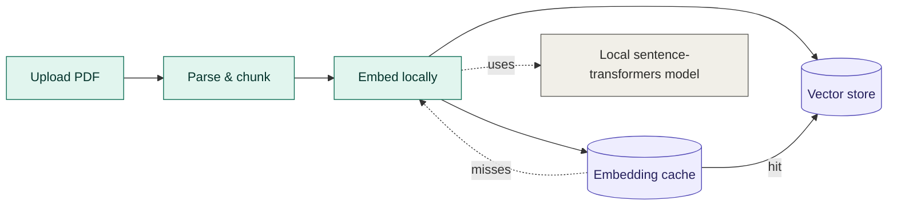
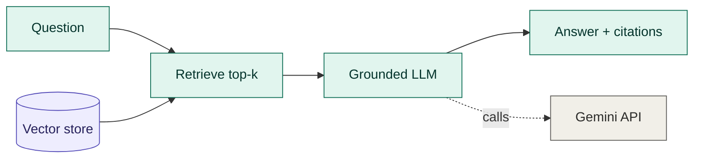
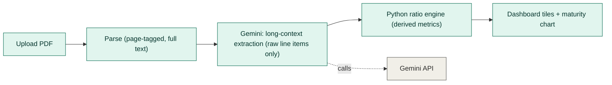
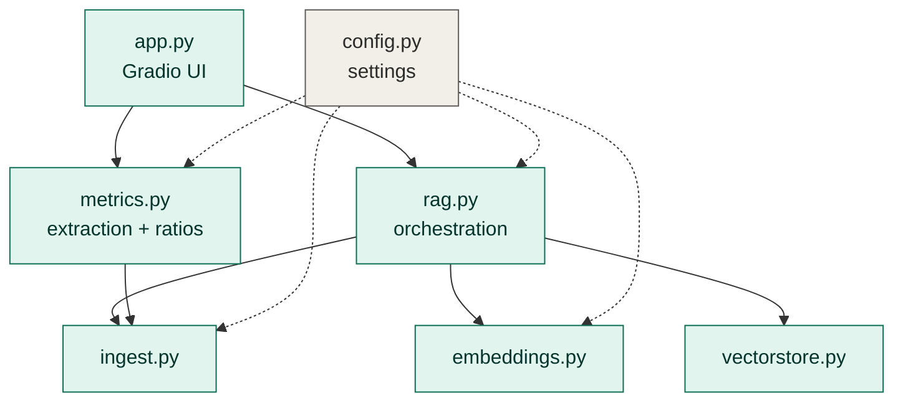

# Architecture — Credit Risk Analyzer (RAG)

This document describes the high-level design of the Credit Risk Analyzer
application: a Retrieval-Augmented Generation (RAG) system that answers questions
about a financial document (10-K, bond prospectus, earnings transcript) using
answers grounded in the document and supported by page-level citations.

See [`REQUIREMENTS.md`](./REQUIREMENTS.md) for the full requirements. Requirement
IDs (e.g. `FR-11`, `NFR-6`) are referenced throughout.

---

## 1. System overview

The system runs in two phases that happen at different times:

- **Indexing** — happens **once per document**, when a PDF is uploaded. The
  document is parsed, chunked, embedded, and stored in a searchable vector index.
- **Querying** — happens **every time** a question is asked. The question is
  embedded, used to retrieve the most relevant chunks from the index, and passed
  to a language model that answers using only that retrieved context.

The **vector store is the seam** between the two phases: indexing writes to it,
querying reads from it. This separation is what keeps the app responsive — the
document is read and embedded only once, not on every question.

The only external dependency that remains for generation is the **Gemini API**,
used for answer generation at query time. Embedding now runs locally with
**sentence-transformers**, and the resulting vectors are cached on disk so
re-indexing the same PDF avoids recomputation. Everything else — parsing,
chunking, retrieval — runs locally in application code.

---

## 2. Indexing phase

Triggered when the user uploads a document.



1. **Parse** — `pypdf` reads the embedded text layer of each page. Page numbers
   come from the reading order (`enumerate(reader.pages, start=1)`), not from the
   printed page label. Pages with no extractable text are skipped, which is also
   how a scanned/image-only PDF is detected and reported (`FR-5`).
2. **Chunk** — each page's text is split into overlapping fixed-size chunks. The
   overlap prevents sentences that straddle a boundary from being lost. Every
   chunk keeps its source **page number**, which is what later enables citations.
3. **Embed** — each chunk is converted into a vector via a local
   sentence-transformers model, so chunks can be compared by meaning rather
   than exact words.
4. **Cache** — embeddings are persisted to disk under a configurable cache dir,
   so the same PDF and chunking configuration are embedded once and reused on
   later runs.
5. **Store** — chunks and their vectors are held in an in-memory vector store for
   the session.

No language model is called in this phase — it only *prepares* the document.

---

## 3. Query phase

Triggered every time the user asks a question. It reuses the index built above.



1. **Embed the question** using the same embedding model as indexing, so the
   question and the chunks live in the same vector space.
2. **Retrieve top-k** — cosine similarity selects the `k` most relevant chunks
   from the vector store (`k` is configurable — `NFR-9`).
3. **Generate a grounded answer** — the retrieved chunks (with their page tags)
   are assembled into a prompt, and the model is instructed to answer **only**
   from that context and to say when the answer is not present, rather than
   guessing (`FR-10`, `FR-12`).
4. **Return the answer with page citations** and show which pages were used
   (`FR-11`, `FR-13`).

---

## 4. How page citations work

Citations are the defining feature of the app, and they depend on carrying the
page number **unbroken** through the whole pipeline:

```
PDF page  ──►  chunk (stamped with page)  ──►  vector  ──►  retrieved chunk
   still carries the page  ──►  prompt context "[p. 12] ..."  ──►  answer cites [p. 12]
```

Because each chunk is stamped with its page at parse time and that tag rides
along through embedding and retrieval, the model receives context already
labelled with page numbers and can cite them. This is what makes an answer
**auditable** — a reader can jump straight to the source page. Grounding +
citations together are the system's most important quality attribute (`NFR-1`).

---

## 5. Credit metrics phase (separate from RAG)

Triggered by the "Extract Credit Metrics" button, independently of the Q&A
tab above. This is a **second, sibling path** through the app — it does not
reuse the embedding/RAG pipeline at all.



1. **Parse** — the same `pypdf`-based page extraction as the RAG path
   (`ingest.load_pdf_pages`), but *not* chunked or embedded: every page's text
   is tagged with its page number and concatenated into one document.
2. **Extract (long-context, one Gemini call)** — the whole page-tagged text is
   sent to `gemini-2.5-flash` with a prompt that restricts it to reading off
   raw, as-reported figures (revenue, debt, cash flow items, the debt-maturity
   schedule) with the fiscal year, source statement, and page each came from.
   The model is explicitly instructed **never to compute a ratio or sum** —
   only report what's printed. This intentionally bypasses the embedding
   pipeline: metrics need every relevant figure in front of the model at once,
   not top-k similarity-retrieved snippets, and indexing a full filing just to
   pull ~30 numbers would risk the free-tier embedding rate limit.
3. **Compute (Python, never the LLM)** — every ratio (margins, leverage,
   coverage, liquidity, cash flow, capital return) is calculated in
   `metrics.py` from the raw extracted line items. If any required input is
   missing, the metric — and anything computed from it — is flagged "not
   available" with a reason, rather than silently substituting zero. LLMs are
   unreliable at arithmetic, so no derived figure is ever LLM output; a wrong
   number in a credit tool is worse than none.
4. **Render** — derived metrics are grouped into tiles (profitability,
   leverage, coverage, liquidity, cash flow, capital return), each carrying a
   citation (statement + page) back to the source filing, plus a bar chart of
   the debt maturity wall.

**Module:** `src/credit_risk_analyzer/metrics.py`. See
[`REQUIREMENTS.md`](./REQUIREMENTS.md) for why this uses direct extraction
instead of the embeddings/RAG path.

---

## 6. Components

| Module | Responsibility |
|--------|----------------|
| `app.py` | Gradio web interface: upload, indexing status, question input, answers, history (`FR-15`) |
| `src/ingest.py` | PDF → page text → overlapping, page-tagged chunks (`FR-2`, `FR-3`, `FR-5`) |
| `src/embeddings.py` | Text → vectors; isolates the embedding provider (`NFR-6`) |
| `src/vectorstore.py` | In-memory cosine-similarity search over chunk vectors (`FR-6`, `FR-9`) |
| `src/rag.py` | Orchestration: build index, retrieve, prompt the model, return cited answer (`FR-10`–`FR-13`) |
| `src/metrics.py` | Long-context line-item extraction + Python-computed credit ratios, independent of the RAG path |
| `src/config.py` | Single place for models, chunk size, top-k, and the grounding prompt (`NFR-7`, `NFR-9`) |

Module relationships:



---

## 7. Key design decisions

- **RAG instead of fine-tuning.** The knowledge lives in the uploaded document,
  which changes every session. Retrieval lets the model use fresh, specific
  content at question time with no retraining, and citations make answers
  auditable — important in a financial context.
- **A transparent numpy vector store.** For a single document the corpus is
  small, so brute-force cosine similarity is fast, dependency-free, and fully
  explainable. `vectorstore.py` is a deliberate seam — it can be swapped for
  FAISS, Chroma, or pgvector when scaling to many large documents (`NFR-6`).
- **Grounding enforced in the prompt.** The system prompt constrains the model to
  answer only from retrieved context and to refuse when the answer is absent,
  which is the main defence against hallucinated figures (`FR-12`, `NFR-1`).
- **Page tags carried end-to-end.** Provenance is preserved from parse through
  answer so every response can cite a page (`FR-11`).
- **One place for configuration.** Models, chunking, and `top-k` live in
  `config.py`, and the Gemini client is created lazily so importing the package
  needs no API key — the key is only required when embedding or generating.
- **Cost-efficient defaults.** Small, inexpensive models are used for both
  embedding and generation to keep per-query cost low (`NFR-7`).
- **Credit metrics use direct long-context extraction, not RAG.** Ratios need
  every relevant figure visible to the model at once (revenue, debt, cash
  flow, the maturity schedule), not top-k similarity-retrieved snippets, and
  indexing a whole filing just to pull ~30 numbers would risk the free-tier
  embedding rate limit. `metrics.py` is a deliberate second path, not a reuse
  of `rag.py`.
- **The LLM extracts, Python computes.** `metrics.py`'s prompt forbids the
  model from computing any ratio or sum — it only reads off raw, as-reported
  figures with a page citation. Every derived metric is calculated in plain
  Python, and any metric with a missing required input becomes "not
  available" rather than a value computed with a substituted zero.

---

## 8. External dependencies and data handling

- **Gemini API** is the sole external service (embeddings + chat + credit
  metrics extraction). API keys are supplied via environment variables /
  platform secrets and never committed (`NFR-4`).
- **No persistence.** Extracted text, chunks, and embeddings exist only in memory
  for the session and are discarded afterwards. Users are advised not to upload
  confidential material to the public demo (`NFR-4`).
- **No training.** The system uses pre-trained models at inference time only; it
  does not train or fine-tune anything.

---

## 9. Known limitations and extension points

| Limitation | Where to extend |
|------------|-----------------|
| Text-based PDFs only (no OCR) | Add an OCR fallback in `ingest.py` |
| Page number is reading order, not printed label | Map printed labels during parse |
| Single document per session | Add per-source metadata; multi-doc index |
| No answer-quality evaluation | Add an eval set of question/answer pairs |
| In-memory store only | Swap `vectorstore.py` for a persistent vector DB |
| Metrics extraction is a single long-context call, no retry-with-narrowing | Chunk the filing by section if a filing exceeds context limits |

These map to the v2 roadmap in [`REQUIREMENTS.md`](./REQUIREMENTS.md) §11.

---

_This project is for research and educational use. It is not financial advice._
